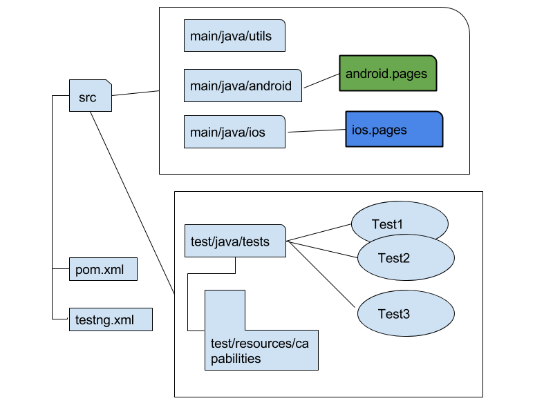

# Minimum Size Cross-Platform Appium Test Framework

## Goals 
* Support both IOS and Android
* Page Object Pattern
* Minimum complexity by using Appium and TestNG only


## How Do I Start
* Clone it
* Have your .app built locally and .apk ready.
* Have Java 1.8 and mvn installed.
* Have Xcode installed and appium server started at 0.0.0.0:4723 and some other pre-requisite ready such as 
```
brew install libimobiledevice
```
and 
```
npm install -g ios-deploy
```
* In order to run Android test in Android emulator, you need to start an Android emulator before hand (you could do it programmatically too such as using bash command) which should match the android capability you are using).
* Run with: mvn test


## Going A Bit Further

### The Structure



* Common libraries/classes with re-usable methods and the base page object class goes into [**utils**](https://github.comcast.com/mxiang001c/rules-mobile-auto/tree/master/src/main/java/utils)
* Android page object classes and driver goes into [**android**](https://github.comcast.com/mxiang001c/rules-mobile-auto/tree/master/src/main/java/android)
* IOS page object classes and driver goes into [**ios**](https://github.comcast.com/mxiang001c/rules-mobile-auto/tree/master/src/main/java/ios)

Your tests goes into [**tests**](https://github.comcast.com/mxiang001c/rules-mobile-auto/tree/master/src/test/java/tests)

Desired Capabilities goes into [**test/resources**](https://github.comcast.com/mxiang001c/rules-mobile-auto/tree/master/src/test/resources)

TestNG startup configuration is at the project root as [**testng.xml**](https://github.comcast.com/mxiang001c/rules-mobile-auto/blob/master/testng.xml)

### Adding New Tests
Very easy, add a new class in [**src/test/java/tests**](https://github.comcast.com/mxiang001c/rules-mobile-auto/tree/master/src/test/java/tests) and write your test code, and add a new test line inside [**testng.xml**](https://github.comcast.com/mxiang001c/rules-mobile-auto/blob/master/testng.xml) so **mvn test** will include your new test.

### Some Notes
* It's quite likely that to test iOS app, you need to compile the iOS app locally instead of copying the .app or .ipa file from somewhere else, it's a limitation for Appium iOS support. There could be some work around, but it will require dev certificate/distribution signature and a bunch of configurations that I'm not intended to bother here.


